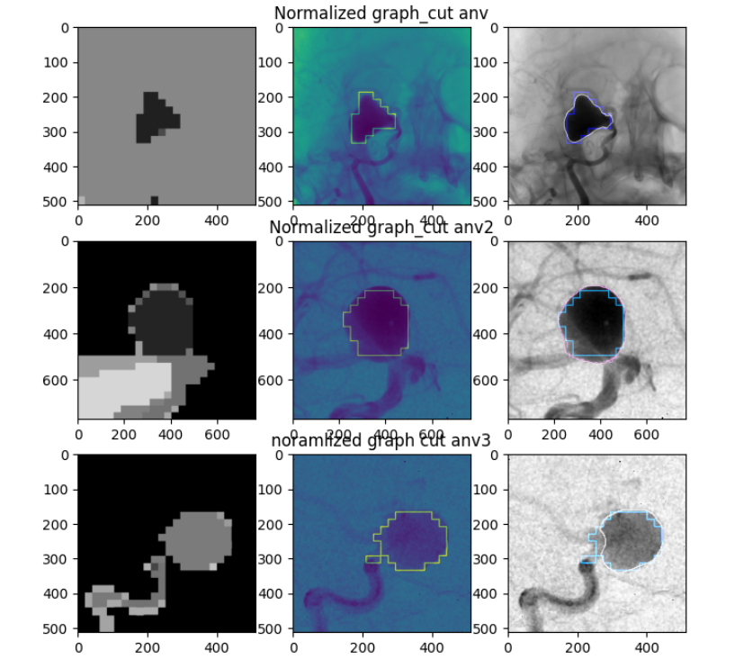

# Image Processing illustrations

This repo contains image processing algorithms, filtering, semi-automatic segmentation, deep learning, and evaluation methods

## Summary

* simple modification
* Image filtering
* Segmentation algorithms
* deep learning (YOLO)
* Evaluation techniques

## 1. Simple modification

## 2. Image filtering

## 3. Segmentation algorithms

In this section, we are going to see the results of several segmentation algorithms

### 3.1 Using Graphcuts

Here we are going to perfrom a segmentation using Graphcut and SLIC algorithms:
SLIC is used here to provide superpixels, in order to facilitate the construction of the graph used for graphcut

**Results**

**Errors**:
Below is the data for each aneurysm using several common segmentation error metrics:

| IoU    | Dice   | Precision | Recall | F1-score | Hausdorff (95th) | Yasnoff |
| ------ | ------ | --------- | ------ | -------- | --------- | ------- |
| 0.2244 | 0.2017 | 0.9012    | 0.8971 | 0.8991   | 11  | 1.1503  |
| 0.2462 | 0.2192 | 0.8044    | 0.9969 | 0.8904   | 32 | 8.0720  |
| 0.2447 | 0.2181 | 0.9152    | 0.8680 | 0.8910   | 45  | 7.3055  |

