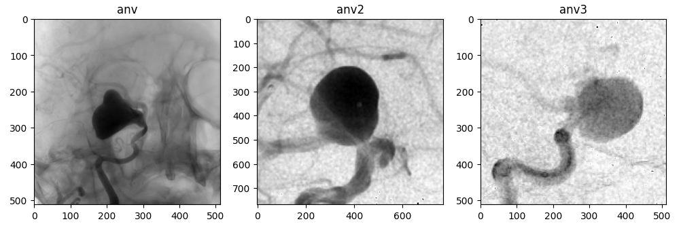
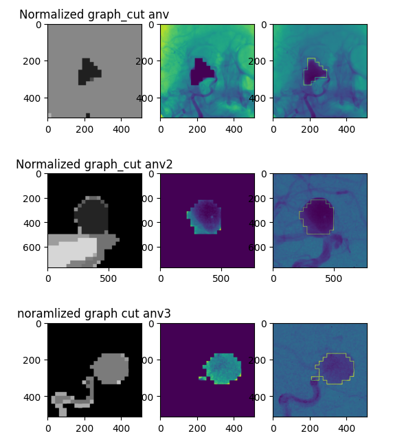

# Image Processing illustrations

This repo contains image processing algorithms, filtering, semi-automatic segmentation, deep learning, and evaluation methods

## Summary

* simple modification
* Image filtering
* Segmentation algorithms
* deep learning (YOLO)
* Evaluation techniques

## 1. Simple modification

## 2. Image filtering

## 3. Segmentation algorithms

In this section, we are going to see the results of several segmentation algorithms

### 3.1 Using Graphcuts

Here we are going to perfrom a segmentation using Graphcut algorithms:

**Results**

